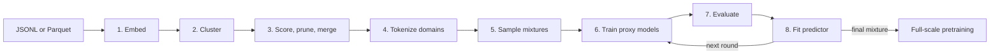

# Nemotron-CLIMB Data Curation

[CLustering-based Iterative Data Mixture Bootstrapping (Nemotron-CLIMB)](https://arxiv.org/abs/2504.13161) finds a pretraining data mixture by grouping documents into semantic domains, testing sampled domain weights with proxy models, and learning which weights predict better benchmark scores. This recipe implements the workflow used to create the [Nemotron-ClimbMix dataset](https://huggingface.co/datasets/nvidia/Nemotron-ClimbMix).

The runnable source is in [`tutorials/text/nemotron-climb-data-curation`](https://github.com/NVIDIA-NeMo/Curator/tree/main/tutorials/text/nemotron-climb-data-curation). Use this page to plan and operate the workflow, then use the [stage reference](/curate-text/tutorials/nemotron-climb/stages) for every command and artifact contract.

<Warning>
This is an advanced, compute-intensive recipe. The paper-scale loop trains and evaluates 112 proxy models before selecting one mixture. Validate every stage on a small corpus first, and budget proxy training separately from curation.
</Warning>

## Workflow



Stages 1–5 create reusable semantic domains and an initial set of mixtures. Stages 6–8 form the iterative search loop. Nemotron-CLIMB uses benchmark performance as the signal for choosing the next mixtures; it does not remove pairwise semantic duplicates. For the separate duplicate-removal workflow, see [semantic deduplication](/curate-text/process-data/deduplication/semdedup).

## Before You Start

### Platform and compute

- Run on Ubuntu 20.04 or 22.04 with CUDA 12.x and an NVIDIA Volta-generation or newer GPU.
- Stages 1 and 2 require at least one GPU. Stages 6 and 7 use all GPUs visible through `CUDA_VISIBLE_DEVICES` (or all GPUs reported by `nvidia-smi`).
- Stage 3 is CPU and memory intensive because each Ray worker loads FastText models. Reduce `--num-cpus` if the host runs out of memory.
- Stage 4 tokenizes on Ray workers. Stages 5 and 8 are CPU-only; stage 8 requires enough evaluated mixtures to form nonempty training and validation splits.
- `6_train.sh`, `7_evaluate.sh`, and `e2e.sh` use GNU/Linux shell features such as `mapfile`, `readarray`, and GNU `find` options.

The supplied proxy configuration is single-node. Adapt the launch command and Megatron parallelism settings before using multiple nodes. The default proxy run exits after approximately 110 minutes, saves every 1,000 iterations, and caps training at 10,000 iterations. In practice, the 110-minute timeout usually stops the run well before 10,000 iterations; the actual iteration count depends on GPU count, GPU type, and model width and depth.

### Storage

Plan space for several durable copies of the corpus plus model outputs:

| Location | Contents | Retain for restart? |
| --- | --- | --- |
| `computed_embeddings/` | Text, generated unique IDs, and embedding vectors | Yes, through clustering; optional after `domains/` exists |
| `clusters/` and `centroids/` | Documents partitioned by centroid and fitted K-means centroids | Yes, through pruning; optional after `domains/` exists |
| `pruned_clusters/` | Quality-scored JSONL grouped into retained or merged domains | Yes, through tokenization; optional after `domains/` exists |
| `domains/` | One merged `.bin`/`.idx` pair per domain | Yes, for every search round and final training |
| `mixtures_*/` | Shell-readable mixture files containing weight and extensionless data-prefix pairs | Yes, paired with evaluation results |
| `megatron_exp_*/` | Proxy checkpoints, data cache, and TensorBoard logs | Yes, until evaluation succeeds; optional afterward unless you need the checkpoints for other work |
| `lm_eval_results_*/` | LM Evaluation Harness JSON results | Yes, for predictor fitting |

Once `domains/` is complete, stages 6–8 no longer read embeddings, clusters, or pruned clusters. You can archive or delete those earlier directories to reclaim space if you do not plan to rerun stages 1–4. Likewise, proxy checkpoints under `megatron_exp_*/` can consume a large share of disk space; delete them after stage 7 succeeds unless you want to run additional evaluations or analysis on those models.

Embedding output can exceed the source corpus because every document includes a dense vector. Proxy checkpoints and Megatron data caches can dominate total storage when many models run concurrently. Put Ray temporary storage, outputs, and checkpoint directories on filesystems with adequate capacity and I/O throughput.

If an input shard is larger than 2 GB, split it before embedding:

```bash
python nemo_curator/utils/split_large_files.py \
    --input-path /data/source \
    --file-type jsonl \
    --output-path /data/source-sharded \
    --target-size-mb 128
```

### Software and model assets

From a NeMo Curator checkout:

```bash
uv sync --extra text_cuda12 --all-groups
source .venv/bin/activate
uv pip install xformers lightgbm

git clone --depth 1 https://github.com/EleutherAI/lm-evaluation-harness
uv pip install -e ./lm-evaluation-harness
```

You also need:

- A Megatron-LM installation and its `pretrain_gpt.py`. The [NeMo Framework container](https://catalog.ngc.nvidia.com/orgs/nvidia/containers/nemo) includes a tested environment; otherwise follow the [Megatron Core installation guide](https://docs.nvidia.com/megatron-core/developer-guide/latest/get-started/install.html).
- The `NovaSearch/stella_en_400M_v5` embedding model. Its remote model code requires xFormers; stage 1 sets `trust_remote_code` and a 512-token maximum automatically when this default is selected.
- The five [Nemotron-CLIMB FastText classifiers](https://huggingface.co/nvidia/nemotron-climb-fasttext-classifiers), or a chosen subset with matching score fields and thresholds.
- Access to the gated `meta-llama/Llama-2-7b` tokenizer used by default, a Hugging Face token, and the corresponding `tokenizer.model` file for Megatron-LM.
- Optionally, a 62M or 350M checkpoint from [Nemotron-CLIMB proxy models](https://huggingface.co/nvidia/nemotron-climb-proxy-models). Training from scratch is also supported.

<Note>
Use the same tokenizer and model shape in stages 4, 6, and 7. If you change the tokenizer, sequence length, layer count, hidden size, attention heads, or parallelism to match a pretrained checkpoint, update both shell scripts consistently.
</Note>

## Configure the Run

Copy the end-to-end driver and edit its variables, or export the same values in your scheduler wrapper:

```bash
cd tutorials/text/nemotron-climb-data-curation
cp e2e.sh e2e.local.sh
```

At minimum, set:

| Variable | Purpose |
| --- | --- |
| `INPUT_PATH`, `INPUT_FILETYPE`, `TEXT_FIELD` | Source dataset and text column |
| `CURATOR_PATH`, `OUTPUT_PATH` | Repository checkout and durable curation output |
| `FASTTEXT_MODEL_PATHS` | Local classifier files used in stage 3 |
| `HF_TOKEN` | Access token for the gated default tokenizer |
| `WORK_BASE_DIR` | Durable proxy training and checkpoint root |
| `MEGATRON_PATH`, `LM_EVAL_PATH` | External training and evaluation repositories |
| `TOKENIZER_MODEL` | Local SentencePiece file used by stages 6 and 7 |
| `PRETRAINED_MODEL_PATH` | Optional Megatron checkpoint; leave empty to train from scratch |

Do not commit `e2e.local.sh` if it contains an access token. Prefer the `HF_TOKEN` environment variable or a secret supplied by the workload manager.

## Choose a Run Profile

<Tabs>
<Tab title="Quick validation">

Use a representative sample to prove the data and model contracts before spending on the full search.

1. Run stages 1–4 on a few small source shards.
2. Reduce `--n-clusters` in stage 2 so clusters are populated (for example, 8–32 rather than 1,000).
3. Generate at least eight mixtures in stage 5. Two is the code-level minimum for a nonempty 90/10 predictor split, but too little for a useful fit.
4. Shorten `--train-iters`, `--lr-decay-iters`, `--exit-duration-in-mins`, and `--save-interval` in a local copy of `6_train.sh`.
5. Train and evaluate every smoke-test mixture, then run stage 8 with `--num-mixtures 1`.

Treat the resulting mixture only as a contract test. A small sample, short proxy runs, or a handful of observations cannot reproduce paper-quality mixture selection.

</Tab>
<Tab title="Full-scale search">

Use the paper-aligned progression after the quick validation succeeds:

| Round | Fit data | New mixtures | Cumulative proxy models |
| --- | --- | ---: | ---: |
| 1 | Corpus token distribution | 64 | 64 |
| 2 | Round 1 evaluations | 32 | 96 |
| 3 | Rounds 1–2 evaluations | 16 | 112 |
| Final | Rounds 1–3 evaluations | 1 | 112 |

Run stages 1–5 once, then train and evaluate each round's mixtures. Pass every evaluation directory and its positionally corresponding mixture directory to stage 8. Use a workload manager such as Slurm to parallelize proxy jobs; `e2e.sh` runs them serially.

The final `optimal_mixture/n1.sh` is the weighted `--train-data-path` input for full-scale Megatron-LM training. Revalidate promising mixtures with another seed before committing the full training budget.

</Tab>
</Tabs>

## Run and Resume

To execute the supplied serial workflow after editing its variables:

```bash
bash e2e.local.sh
```

The script treats the existence of each top-level output directory as a completed stage. This makes clean restarts inexpensive, but a directory left by an interrupted process is also skipped. That behavior applies to `e2e.sh`; if you run stages manually, you decide whether to keep or remove each output directory before rerunning a step.

Before restarting:

1. Inspect the last stage's output against the [artifact contracts](/curate-text/tutorials/nemotron-climb/stages).
2. Keep outputs from every fully completed earlier stage.
3. Move or remove only the incomplete stage directory, then rerun the driver.
4. For stage 6 without `PRETRAINED_MODEL_PATH`, keep `WORK_PATH/checkpoint`; Megatron loads it and resumes naturally. A `WORK_PATH` directory alone causes `e2e.sh` to skip that model, so relaunch `6_train.sh` directly when resuming an interrupted proxy.
5. Keep each `lm_eval_results_*` directory paired with the exact `mixtures_*` directory that produced its models.

<Warning>
Never merge results and mixture directories from different rounds by name alone. Stage 8 matches `n1`, `n2`, and so on within each positional input pair; a mismatched pair silently associates benchmark scores with the wrong weights.
</Warning>

## Next Step

Continue to the [stage reference](/curate-text/tutorials/nemotron-climb/stages) for exact commands, inputs, outputs, tuning controls, and completion checks for stages 1–8.
